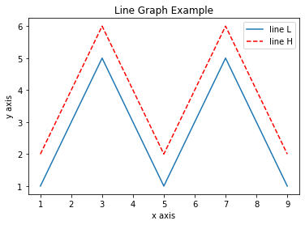
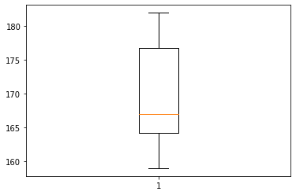

https://github.com/MyDearGreatTeacher/AI4ALL/blob/master/%E8%B3%87%E6%96%99%E5%88%86%E6%9E%90/Matplotlib%E5%AF%A6%E6%88%B0.md

作業: 武漢肺炎 bar chart

作業:https://matplotlib.org/api/pyplot_summary.html box plot
             178   164  159  162  182  
             179   166  168  173  165 

import matplotlib.pyplot as plt
 
x  = [1, 2, 3, 4, 5, 6, 7, 8, 9]

y1 = [1, 3, 5, 3, 1, 3, 5, 3, 1]

y2 = [2, 4, 6, 4, 2, 4, 6, 4, 2]

plt.plot(x, y1, label="line L")

plt.plot(x, y2,'r--',label="line H") #x軸,y軸,顏色虛線,註解

plt.plot()

plt.xlabel("x axis")  #y軸名稱

plt.ylabel("y axis")  #x軸名稱

plt.title("Line Graph Example")  #輸出圖片title

plt.legend()

plt.show()

"作業一" 

蓝色： 'b' (blue)

绿色： 'g' (green)

红色： 'r' (red)

蓝绿色(墨绿色)： 'c' (cyan)

红紫色(洋红)： 'm' (magenta)

黄色： 'y' (yellow)

黑色： 'k' (black)

白色： 'w' (white)

实线： '-'

虚线： '--'

虚点线： '-.'

点线： ':'

点： '.' 

#每個點的標記

像素： ','

圆形： 'o'

上三角： '^'

下三角： 'v'

左三角： '<'

右三角： '>'

方形： 's'

加号： '+' 

叉形： 'x'

棱形： 'D'

细棱形： 'd'

三脚架朝下： '1'

三脚架朝上： '2'

三脚架朝左： '3'

三脚架朝右： '4'

六角形： 'h'

旋转六角形： 'H'

五角形： 'p'

垂直线： '|'

水平线： '_'

"作業二"
